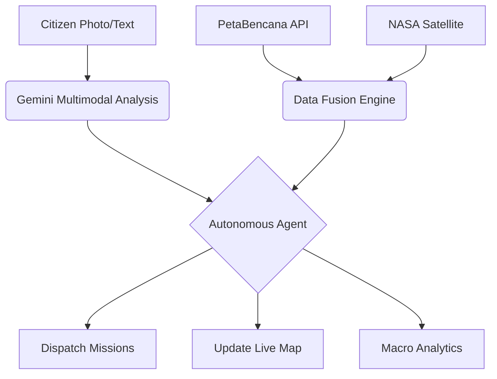

# 🌊 SIAGA Jalan
### Autonomous Agentic Flood Intelligence & Response System

**SIAGA Jalan** is a state-of-the-art urban resilience platform designed to transform flood management in Jakarta. By combining **Autonomous Agentic AI**, **Multimodal Processing**, and **Macro-Spatial Analytics**, SIAGA Jalan transitions from a passive monitoring tool to an active, decision-making command center.

---

## 🚀 Key Innovation: The Agentic Loop
Unlike traditional dashboards, SIAGA Jalan features an **Autonomous Command Core** powered by Google's **Gemini 3 Pro**. 

1.  **See**: Ingests real-time feeds from PetaBencana API, NASA Satellite (MODIS/Terra), and multimodal citizen reports.
2.  **Think**: Analyzes spatial data and visual evidence to determine incident severity and risk level.
3.  **Act**: Autonomously dispatches missions, reroutes public transport, and alerts local authorities without manual intervention.

---

## ✨ Core Features

### 🖥️ Autonomous Command Center
*   **Agentic Command Core**: A live "log of thought" where the AI reasons through incoming data and executes autonomous directives.
*   **Live Mission Execution**: Real-time tracking of AI-driven interventions across the city.
*   **Risk Prediction**: 24-hour predictive modeling of water levels using historical sensor history.

### 🗺️ Live Geospatial Intelligence
*   **Dual-Layer Mapping**: Switch between high-contrast Dark Maps for tactical operations and **NASA Satellite (Daily MODIS)** for global context.
*   **AI-Intervention Overlay**: Interactive map markers distinguishing autonomous AI missions from general citizen reports.
*   **PetaBencana Integration**: Seamless live-sync with Jakarta's primary flood reporting network.

### 📊 Spatial Insights (MapBiomas Inspired)
*   **Land Use Impact**: Advanced analytics quantifying flood coverage across Settlements, Industrial, and Green Space zones.
*   **Temporal Timeline**: 5-year historical trend analysis of inundation area (Ha) and severity.
*   **Economic Risk Mapping**: Real-time estimation of GDP-at-risk based on flood location and land value.

### 📱 Citizen Empowerment
*   **Multimodal Reporting**: Anonymously report hazards with photos. SIAGA's AI analyzes images to verify depth and hazard type instantly.
*   **Safe Route Optimizer**: Dynamic routing that avoids submerged roads based on live geospatial data.

---

## 🛠️ Tech Stack

*   **Logic**: React 19 + TypeScript
*   **AI Engine**: Google Gemini 3 (via `@google/genai`)
*   **Satellite Intelligence**: NASA EPIC & EONET APIs
*   **Mapping**: Leaflet.js + NASA GIBS WMTS
*   **Animations**: Motion (Framer Motion)
*   **UI/UX**: Tailwind CSS (Command Center Aesthetic)
*   **Data Viz**: Recharts

---

## 🏗️ Architecture



---

## 🏁 Getting Started

1.  **Clone the repository**
2.  **Install dependencies**:
    ```bash
    npm install
    ```
3.  **Set Environment Variables**: Ensure `GEMINI_API_KEY` is configured in your environment.
4.  **Run Development Server**:
    ```bash
    npm run dev
    ```

---

## 🏆 Hackathon Context
This project was developed for the **Gemini Agentic AI Hackathon**, focusing on how LLMs can go beyond chat to become autonomous administrators of critical urban infrastructure.

**Vision**: To eliminate human latency in emergency response and provide city planners with the strategic data needed to build a "Sponge City" future.

---
**SIAGA Jalan** | *Autonomous Intelligence for a Resilient City.*
